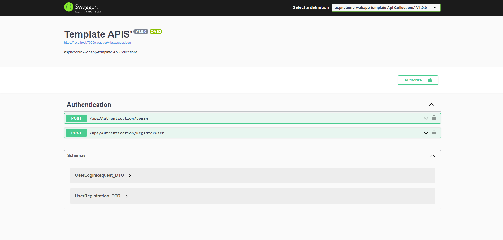

# aspnetcore-webapp-template

This is a template project for building a web application using .NET 6 as the backend technology and SQL Server as the database. It provides a structured starting point for your project, allowing you to focus on your application's specific features and functionality.

## Features
* .NET 6: This project is built using the latest .NET version, providing you with the latest features, performance improvements, and security updates.
* SQL Server Database: SQL Server is used as the primary database for storing and managing your application's data. It's a robust and scalable choice for relational data storage.
* Entity Framework Core: Entity Framework Core is used as the Object-Relational Mapping (ORM) framework for working with the database. It simplifies data access and allows you to define your data model using C# classes.
* Dependency Injection: .NET 6's built-in Dependency Injection container is configured for managing application dependencies. This promotes clean, testable, and maintainable code.
* API Endpoints: A basic set of API endpoints is pre-configured, including endpoints for user authentication.
* Authentication and Authorization: User authentication is set up using JSON Web Tokens (JWT) for securing your API endpoints. You can easily expand this to include role-based authorization.
* Swagger Documentation: Swagger UI is included to help you explore and test your API endpoints easily. It provides interactive documentation for your APIs.

## Getting Started
1. Prerequisites: Before you begin, ensure you have the following installed:
   * [.NET 6 SDK](https://dotnet.microsoft.com/download)
   * [SQL Server](https://www.microsoft.com/en-us/sql-server/sql-server-downloads)
2. Database Setup:
   * After cloning the Repo go inside Database folder and execute the script, After that update the connection string in appsettings.json with your database details.
3. Running the Application:
   * Clone or download this repository.
   * Navigate to the project folder in your terminal and run `dotnet restore` to restore the required dependencies.
   * Start the application by running `dotnet run`.
   * To Login as admin there is an admin user created already that has username `admin` and password `pass123`. You can use this credential to login.
4. API Documentation:
   * Access the API documentation using Swagger UI at `https://localhost:7050/swagger/index.html`.
    
5. Customization:
   * To add a client you can use Client folder inside Api class library in which a sample angular app is loaded, you can change it according to your needs.
   * Add additional libraries, services, and middleware as needed for your project.
   * Extend authentication and authorization to meet your security requirements.

## Project Structure
```
├─Code
│	├─Api (WebApp, Add Client inside Client folder here)
│	├─Domain (Domain Layer, Entities are here)
│	├─Application (Application Layer, Application Logic comes here, Any common things like interfaces are here, dtos are here)
│	└─Infrastructure (Infrastructure Layer, DataAccess is here)
└─Database
	└─database-creation-script.sql
```

## Disclaimer
This template project is provided as a starting point and may not cover all use cases or security requirements for your specific application. It is your responsibility to assess and enhance security, testing, and compliance according to your application's needs.